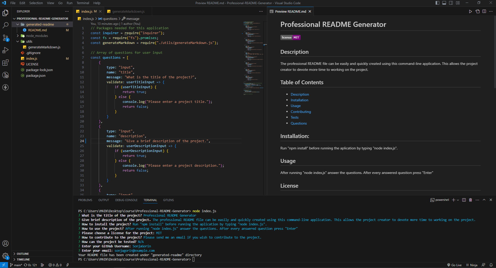

# Professional README Generator
  
  ## Description
  The professional README file can be easily and quickly created using this command-line application.  
  This allows the project creator to devote more time to working on the project.
  ## Installation:
  Run "npm install" before running the application by typing "node index.js". 
  ## Usage
  After running "node index.js" answer the questions. After every answered question press "Enter"

  Preview:

  
  
  ## License
  Please refer to the license badge on top of the README file. For more information about the license please click on the license badge.

